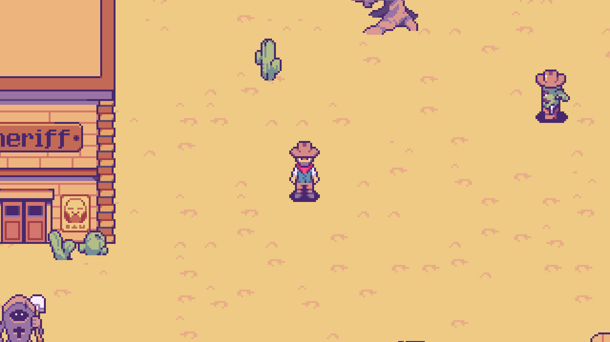
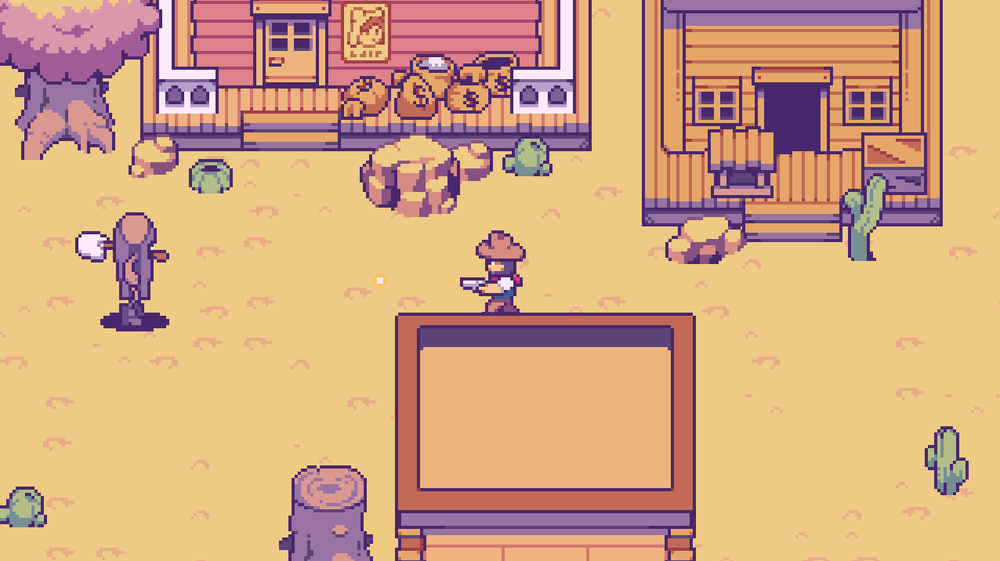

# py-western-shooter-game
Western Shooter game made in python with pygame. This project is for "Learn Python by making games" course by Christian Koch

## Enemies
* Cactus: shoot from long distance
* Coffin: hit you with a shovel

* Controable with the WASD keys.
* Shoot with "Space" key.
